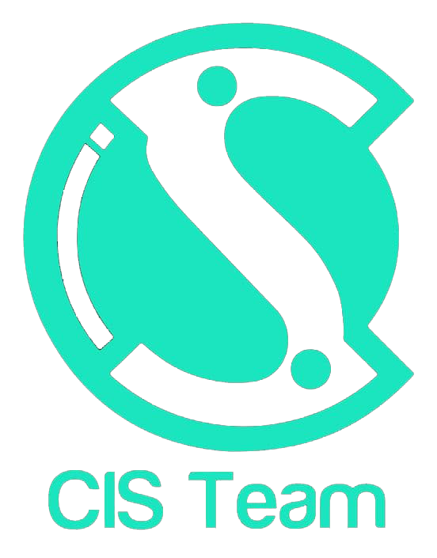
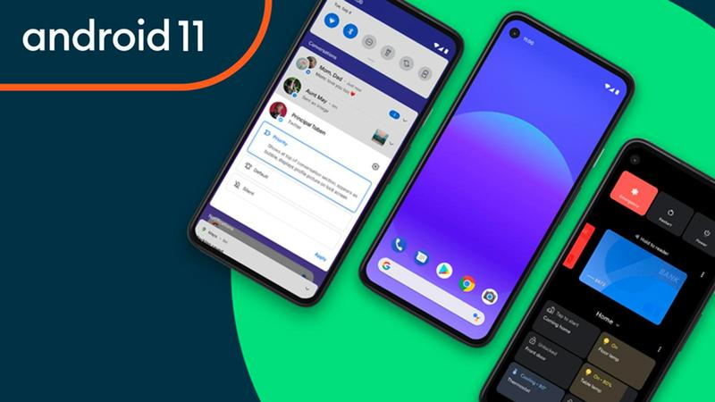
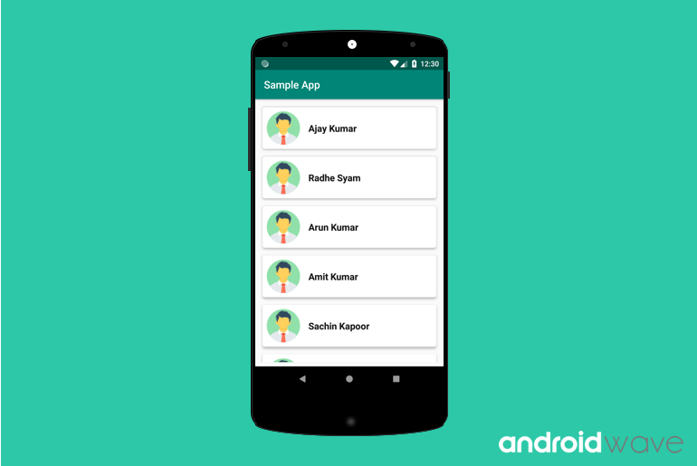
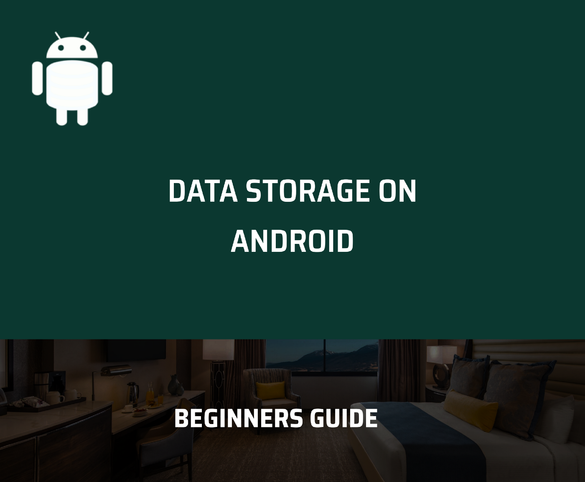
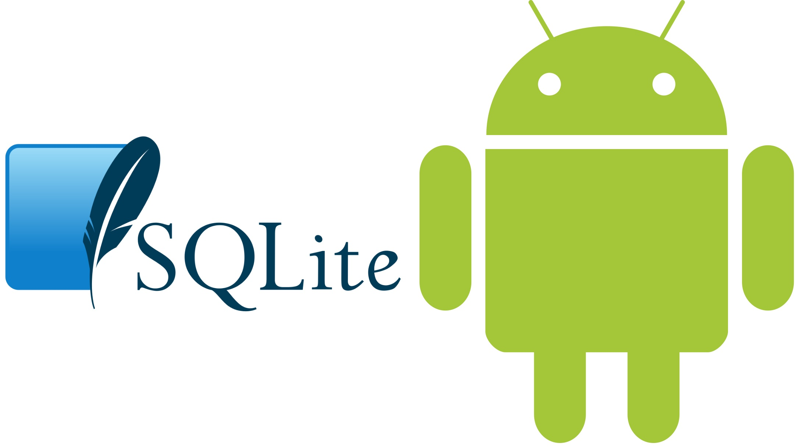
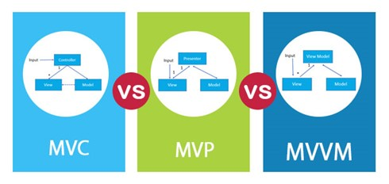
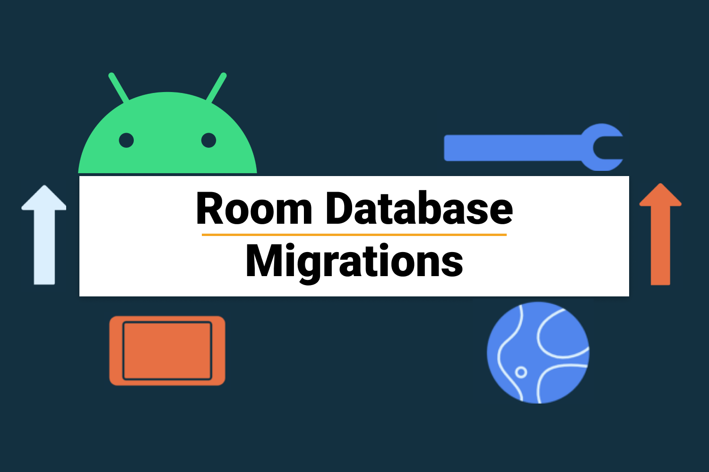
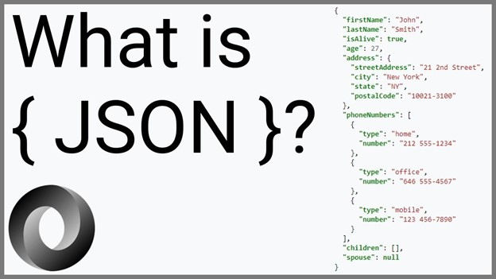
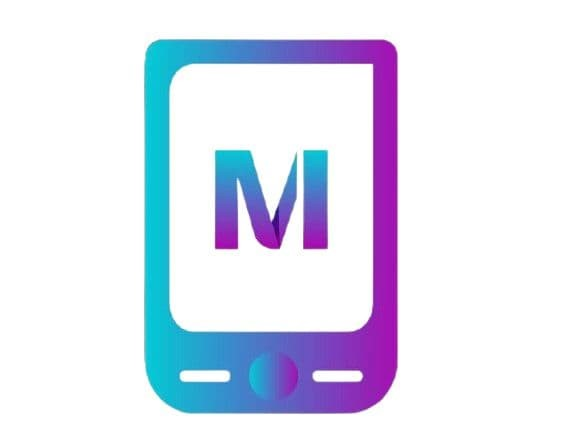

# Android Squad Roadmap

We are in **[CIS Team](https://cisteam.org/)** introduce to you the best road to help you to learn Android Track **by Java Programming Language**

Android :is a [mobile operating system](https://en.wikipedia.org/wiki/Mobile_operating_system) **based on a modified version of the** [**Linux kernel**](https://en.wikipedia.org/wiki/Linux_kernel 'Linux kernel') and other [open source](https://en.wikipedia.org/wiki/Open-source_software 'Open-source software') software, designed primarily for [**touchscreen**](https://en.wikipedia.org/wiki/Touchscreen 'Touchscreen') mobile devices such as [**smartphones**](https://en.wikipedia.org/wiki/Smartphone 'Smartphone') and [**tablets**](https://en.wikipedia.org/wiki/Tablet_computer 'Tablet computer')**.**

## Notes:

- We Recommend to read more and more about Android and his History
- We recommend to you first to have good Knowledge about:

  1. OOP
  2. Database
  3. Operating System

---

## This roadmap would consist of 5 levels:

| 📝Level                  | 🔎Content                                                            |
| ------------------------ | -------------------------------------------------------------------- |
| [**Level 0**](#level-0)  | Learn java language to be prepared for Android fields.               |
| [**Level 1**](#level-1)  | Learn the basics.                                                    |
| [**Level 2**](#level-2)  | Learn how to develop a Small app using local database (Sqlite,room). |
| [**Level 3**](#level-3)  | learn haw to get data from server (Netwarking ,firebase).            |
| [**Level 4**](#level-4)  | Dealing with fragment ,gps and publishing your app.                  |
| [**Contact**](#contacts) | Fell free to contact me any time.                                    |

---

# Level 0:

**Java** is a [high-level](https://en.wikipedia.org/wiki/High-level_programming_language 'High-level programming language'), [class-based](https://en.wikipedia.org/wiki/Class-based_programming 'Class-based programming'), [object-oriented](https://en.wikipedia.org/wiki/Object-oriented_programming 'Object-oriented programming') [programming language](https://en.wikipedia.org/wiki/Programming_language 'Programming language') that is designed to have as few implementation [dependencies](<https://en.wikipedia.org/wiki/Dependency_(computer_science)> 'Dependency (computer science)') as possible. It is a [general-purpose](https://en.wikipedia.org/wiki/General-purpose_language 'General-purpose language') programming language intended to let [application developers](https://en.wikipedia.org/wiki/Application_developer) _write once._

## Java Programming Language Resources:

---

1. **Abdullah Eid**:

   - [Java101](https://www.coursat.org/course/59/java-101)
   - [Java102](https://www.coursat.org/course/60/java-102)
   - [Java103](https://www.coursat.org/course/69/java-103)
   - [Java104](https://www.coursat.org/course/70/java-104)

2. **Hassouna Academy**:
   - [Course](https://youtube.com/playlist?list=PLHIfW1KZRIfn9BnepQuzWiM_ZPIwUDawL)

---

# Level 1:

In this level we will learn principle of designing user interface, interacting with design and dealing with multi-screen in app.

## Resources:

- [user Interface Course](https://www.udacity.com/course/android-basics-user-interface--ud834)
- [User Input](https://www.udacity.com/course/android-basics-user-input--ud836)
- [Multiscreen](https://www.udacity.com/course/android-basics-multiscreen-apps--ud839)

`Try to make Calculator app with what you learned for example or any task for improving your skill`

---

# Level 2:

First we will learn recycler view:

`RecyclerView makes it easy to efficiently display large sets of data. You supply the data and define how each item looks, and the RecyclerView library dynamically creates the elements when they're needed.`

## Resources:

- [Coding with nerds](https://www.youtube.com/watch?v=za2oNpHjYL8&list=PLXjbGq0ERjFrBsFp69NhGzyyupl6R0YdD)

- [Coding with flow](https://www.youtube.com/watch?v=Nw9JF55LDzE&list=PLrnPJCHvNZuBtTYUuc5Pyo4V7xZ2HNtf4)

---

**SQLite** is **a** [**relational database management system**](https://en.wikipedia.org/wiki/Relational_database_management_system) (RDBMS) contained in a [**C**](<https://en.wikipedia.org/wiki/C_(programming_language)> 'C (programming language)') [**library**](<https://en.wikipedia.org/wiki/Library_(computer_science)> 'Library (computer science)'). In contrast to many other database management systems, SQLite is not a [client–server](https://en.wikipedia.org/wiki/Client%E2%80%93server 'Client–server') database engine. Rather, it is embedded into the end program.

---

In this level you will learn about data storage in android but we recommend to you to refresh the basic of database

## Resources:

- [Database basic](https://maharatech.gov.eg/enrol/index.php?id=740)
- [Database crash course](https://www.youtube.com/watch?v=HXV3zeQKqGY)

---

**Now can go in SQLite database in Android. 😃❤**

## Resources:

- [Data Storage](https://classroom.udacity.com/courses/ud845)
- [anther](https://www.youtube.com/watch?v=cp2rL3sAFmI&list=PLS1QulWo1RIaRdy16cOzBO5Jr6kEagA07) **(first 6 videos )**

---

## `Now we will learn architecture patterns. 🔥🔥`

**Architectural pattern** is a general, reusable solution to a commonly occurring problem in [**software architecture**](https://en.wikipedia.org/wiki/Software_architecture 'Computer hardware') within a given context.[[1]](https://en.wikipedia.org/wiki/Architectural_pattern#cite_note-TMD-1) The architectural patterns address various issues in [**software engineering**](https://en.wikipedia.org/wiki/Software_engineering 'Software engineering'), such as [**computer hardware**](https://en.wikipedia.org/wiki/Computer_hardware) performance limitations, [**high availability**](https://en.wikipedia.org/wiki/High_availability 'High availability') and minimization of a [**business risk**](https://en.wikipedia.org/wiki/Business_risk 'Business risk'). Some architectural patterns have been implemented within [**software frameworks**](https://en.wikipedia.org/wiki/Software_framework 'Software framework').

## Resources:

- [Coding with nerds](https://www.youtube.com/watch?v=3dzVWgIUkX8&list=PLXjbGq0ERjFoCtb7aH910dtddLePNI6w7)
- Coding with flow

---

The Room persistence library provides an abstraction layer over SQLite to allow for more robust database access while harnessing the full power of SQLite.

## Resources:

- [Coding with nerds](https://www.youtube.com/watch?v=SkvNpRKnZNE&list=PLXjbGq0ERjFq5Y3vEK1v0ic5oEAqmpHa7)
- [Coding with flow](https://codinginflow.com/tutorials/android/room-viewmodel-livedata-recyclerview-mvvm/part-1-introduction)

- [khadijah tech](https://www.youtube.com/watch?v=u2h4TQ6XDdo&list=PLUW2KB2aXoGvoWRWUmre4xtOyxPKYPJsx)

`Now can do notes app using room database 💪🏻 `

---

# Level 3:

      First we will know concept of JSON.

**JSON** (**JavaScript Object Notation** is an [**open standard**](https://en.wikipedia.org/wiki/Open_standard 'Open standard') [**file format**](https://en.wikipedia.org/wiki/File_format 'File format') and [**data interchange**](https://en.wikipedia.org/wiki/Electronic_data_interchange 'Electronic data interchange') format that uses [**human-readable**](https://en.wikipedia.org/wiki/Human-readable_medium) text to store and transmit data objects consisting of [**attribute–value pairs**](https://en.wikipedia.org/wiki/Attribute%E2%80%93value_pair 'Attribute–value pair') and [**arrays**](https://en.wikipedia.org/wiki/Array_data_type 'Array data type') (or other **[serializable](https://en.wikipedia.org/wiki/Serialization 'Serialization')** values). It is a common [**data**](https://en.wikipedia.org/wiki/Data 'Data') format with a diverse range of functionality in [**data interchange**](https://en.wikipedia.org/wiki/Electronic_data_interchange 'Electronic data interchange') including communication of [**web applications**](https://en.wikipedia.org/wiki/Web_application 'Human-readable medium') with [**servers**](<https://en.wikipedia.org/wiki/Server_(computing)> 'Server (computing)').

## Resources:

- [Coding with flow](https://www.youtube.com/watch?v=f-kcvxYZrB4&list=PLrnPJCHvNZuDeEk_E_DPOtKdf_HQ6BS36)

---

`Then we will learn networking usinh http request and retrofit library`

## Resources:

- [Udacity](https://www.udacity.com/course/android-basics-networking--ud843)
- [Retrofit](https://www.youtube.com/watch?v=4JGvDUlfk7Y&list=PLrnPJCHvNZuCbuD3xpfKzQWOj3AXybSaM)

**Firebase** is a platform developed by Google for creating [**mobile**](https://en.wikipedia.org/wiki/Mobile_phone_application 'Mobile phone application') and [**web**](https://en.wikipedia.org/wiki/Web_application 'Web application') applications. It was originally an independent company founded in 2011.[[1]](https://en.wikipedia.org/wiki/Firebase#cite_note-1) In 2014, Google acquired the platform[[2]](https://en.wikipedia.org/wiki/Firebase#cite_note-2) and it is now their flagship offering for app development.

## Resources:

- [Coding with flow](https://www.youtube.com/watch?v=JVokoelQ1RI&list=PLrnPJCHvNZuBf5KH4XXOthtgo6E4Epjl8)

---

# Level 4:

      At this level you can move forward and learn more and more 💪🏻💪🏻🔥🔥

you can watch this course also 😃👉 [Advanced Android App Development
](https://classroom.udacity.com/courses/ud855)

---

# Contacts:

> Fell free to contact me any time ❤

  

  

- [**Facebook**](https://www.facebook.com/Elmorshdy-Studio-107750101603289/?ref=pages_you_manage)

- [**Twitter**](https://twitter.com/elmor555)
